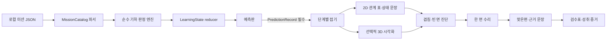

# Net Folding Inspection Center Implementation Plan

> **For agentic workers:** REQUIRED SUB-SKILL: Use superpowers:subagent-driven-development (recommended) or superpowers:executing-plans to implement this plan task-by-task. Steps use checkbox (`- [ ]`) syntax for tracking.

**Goal:** 초등 5~6학년 학생이 정육면체 전개도의 기준면과 접는 순서를 먼저 예측하고, 한 면씩 접은 결과에서 겹침·빈 면·장식 방향을 구분해 진단한 뒤, 한 면만 옮겨 수리하고 기하 용어로 근거를 설명하는 서버 없는 한국어 학습 SPA를 구축합니다.

**Architecture:** 순수 TypeScript 기하 엔진이 격자 전개도를 정수 벡터 기반 3차원 면 프레임으로 변환하고 유효성·겹침·빈 방향·맞은편·장식 방향을 판정하는 유일한 권위가 됩니다. React 학습 상태 머신은 `관찰 → 예측 제출 → 단계별 접기 → 진단 → 한 면 수리 → 근거 확인` 순서를 강제하며, 2D 관계 표와 상태 문장을 완전한 학습 경로로 제공하고 React Three Fiber 뷰어는 동일한 계산 결과를 시각화만 합니다. 미션 콘텐츠, 판정 엔진, 상태, 2D 상호작용, 3D 표시를 분리해 정육면체 MVP를 안정적으로 검증하고 각기둥 콘텐츠를 별도 검사기 추가 지점으로 남깁니다.

**Tech Stack:** Node.js 24.13.1, npm 11.12.0, Vite, React, TypeScript strict mode, Three.js, React Three Fiber, Vitest, Testing Library, Playwright, `@axe-core/playwright`, ESLint, 정적 CSS

**Spec:** `/Volumes/ External Drive 256G/Dev2/codex/net-folding-inspection-center/2026-08-26-net-folding-inspection-center-design.md`

## Global Constraints

- 대상은 초등 5~6학년, 교과는 수학, 한 차시 권장 시간은 30~40분입니다.
- 교육과정 `[6수03-04]`, `[6수03-06]`에 맞춰 이해·적용·분석·창안의 성취 증거를 각각 수집합니다.
- 학습 순서는 `예측 표시 → 한 면씩 접기 → 충돌 원인 확인 → 최소 수정`이며, 예측 제출 전에는 3D 결과와 정답 판정을 열지 않습니다.
- 3D는 판정 권위가 아닌 시각화입니다. 판정 로직은 Three.js 또는 React 객체를 import하지 않는 순수 TypeScript 모듈이어야 합니다.
- 정육면체 MVP에는 정확히 8개 미션, 예측, 단계별 접기, 겹침 진단, 맞은편 찾기, 한 면 수리, 근거 문장, 2D 대체 보기, 키보드 완전 조작을 포함합니다.
- 자유형 3D 모델러, 실제 포장 치수·재료 계산, 온라인 공유, AI 이미지 인식, 카메라 스캔, 서버, 로그인, 외부 AI, 사용자 파일 업로드를 포함하지 않습니다.
- 각기둥 미션과 인쇄용 도안은 MVP 밖의 확장 범위로 두되, 순수 `NetDefinition`과 화면 독립 `NetInspector` 계약을 통해 기존 정육면체 판정기를 바꾸지 않고 추가할 수 있게 합니다.
- 실제 종이의 두께·탄성·휘어짐이나 포장재의 강도·안전성을 예측하지 않는 기하 모형임을 검수 접수 화면과 접기실에 명시합니다.
- 첫 예측 오류에 감점하지 않고, 순위·속도·타이머를 사용하지 않으며, 전체 정답 전개도를 즉시 공개하지 않습니다.
- 색만으로 면을 구분하지 않고 면 번호와 서로 다른 도형 무늬를 함께 표시합니다.
- 자동 회전은 기본으로 끄고, 고정 시점과 `한 면씩 보기`, 기준면 고정을 제공합니다.
- 현재 단계에서 꼭 필요한 주요 버튼 정확히 하나만 `gi-pulse`로 강조합니다. `prefers-reduced-motion: reduce`에서는 애니메이션을 제거하고 지속적인 굵은 윤곽선으로 대체합니다.
- 드래그 없이 `면 선택 → 이동할 칸 선택 → 확인`만으로 모든 수리 미션을 완료할 수 있어야 합니다.
- 기본 진행 상태는 메모리에만 두고, 사용자가 명시적으로 선택한 경우에만 `sessionStorage`에 저장합니다. 이름·학번·이메일 등 개인정보 필드를 만들지 않습니다.
- 375px 너비, 키보드 전용, 브라우저 확대 200%, 고대비, 모션 감소, 스크린 리더에서 핵심 흐름이 유지되어야 합니다.
- 화면 오른쪽 아래에 작은 `업데이트 내역` 버튼을 두고 `2026-08-26` 설계 기록과 실제 구현·개선 날짜별 기록을 표시합니다.
- 직접 작성하는 `.ts`, `.tsx`, `.css`, `.mjs`, `.json` 파일은 각각 500줄 미만이어야 하며 생성물인 `package-lock.json`만 줄 수 검사에서 제외합니다.
- 이 문서의 모든 셸 명령은 구현 단계에서 실행할 예정 명령입니다. 계획 작성 단계에서는 설치, Git 생성, 커밋, 푸시, 배포를 실행하지 않습니다.

---

## 요구사항-작업 대조표

| 설계 요구 | 구현 연결 | 검증 연결 |
|---|---|---|
| 모서리 연결이 입체 면 관계를 결정함을 설명 | Task 2~4의 인접 그래프·면 프레임, Task 8의 관계 표 | 11개 정육면체 전개도 전수 단위 테스트, 2D 학습 E2E |
| 기준면·윗면·접는 순서 예측 | Task 6~7의 예측 게이트와 예측판 | 예측 전 결과 잠금 컴포넌트·E2E 테스트 |
| 겹치는 면·빈 면·뒤집힌 방향 분석 | Task 3~4의 분리 판정, Task 10의 오류 탐지 | 충돌 쌍·빈 법선·장식 방향 독립 테스트 |
| 한 칸 이동 또는 회전으로 수리 | Task 11의 선택식 수리와 최소 변경 판정 | 정확히 한 면 변경·연결·유효성 테스트 |
| 기존 평면 이동·자유 3D·꾸미기 앱과 차별화 | 제한된 고정 시점, 단계 접기, 근거 제출, 장식 도구 미제공 | Task 9·13에서 예측 전 Canvas 부재와 자유 회전 부재 확인 |
| 정육면체 8개 미션 | Task 5의 네 JSON 파일에 유형별 2개 | 카탈로그 스키마와 엔진 정답 일치 테스트 |
| 2D만으로 동등한 학습 | Task 8의 관계 표·상태 문장, 모든 화면의 HTML 조작 | WebGL 미지원 및 2D 전용 E2E |
| 접근성·모바일 | Task 7~9, 14, 16 | axe, 키보드, 375px, 200%, reduced motion, VoiceOver 점검 |
| 개인정보·안전·교육적 한계 | Task 6·15 | 저장 동의 테스트, 네트워크 API 정적 검사, 안전 문구 E2E |
| 완료 기준 전체 | Task 16의 릴리스 게이트 | lint, typecheck, unit, e2e, build, 파일 크기 검사 모두 성공 |

## 학습 및 데이터 흐름



## 핵심 타입과 명명 계약

다음 이름은 전 작업에서 동일하게 사용합니다.

```ts
export type FaceId = 'F1' | 'F2' | 'F3' | 'F4' | 'F5' | 'F6';
export type QuarterTurn = 0 | 1 | 2 | 3;
export type AxisDirection = '+x' | '-x' | '+y' | '-y' | '+z' | '-z';
export type FoldDirection = 'north' | 'east' | 'south' | 'west';
export type MissionKind = 'tracking' | 'opposite' | 'collision' | 'repair';
export type LearningStage =
  | 'intake'
  | 'prediction'
  | 'folding'
  | 'diagnosis'
  | 'repair'
  | 'evidence'
  | 'complete';

export interface GridPoint { readonly x: number; readonly y: number }
export type IntAxis = -1 | 0 | 1;
export type Vec3 = readonly [IntAxis, IntAxis, IntAxis];
export interface FaceFrame {
  readonly normal: Vec3;
  readonly right: Vec3;
  readonly down: Vec3;
  readonly center: Vec3;
}
export interface FaceDefinition {
  readonly id: FaceId;
  readonly grid: GridPoint;
  readonly colorToken: 'blue' | 'yellow' | 'green' | 'coral' | 'purple' | 'teal';
  readonly symbol: 'circle' | 'triangle' | 'square' | 'star' | 'diamond' | 'cross';
  readonly decorationQuarterTurn: QuarterTurn;
}
export interface NetDefinition { readonly faces: readonly FaceDefinition[] }
export interface PredictionRecord {
  readonly baseFaceId: FaceId;
  readonly predictedTopFaceId: FaceId;
  readonly foldOrder: readonly FaceId[];
  readonly arrowByFace: Readonly<Partial<Record<FaceId, FoldDirection>>>;
  readonly submittedAtIso: string;
}
```

## 예상 파일 구조와 책임

```text
net-folding-inspection-center/
├── 2026-08-26-net-folding-inspection-center-design.md
├── 2026-08-26-net-folding-inspection-center-implementation-plan.md
├── .gitignore                           # node_modules, dist, 테스트 산출물 제외
├── package.json                         # 스크립트와 런타임·테스트 의존성
├── package-lock.json                    # npm 잠금 파일
├── index.html                           # 한국어 SPA 진입 문서
├── vite.config.ts                       # Vite/Vitest 구성
├── tsconfig.json
├── tsconfig.app.json
├── tsconfig.node.json
├── eslint.config.js
├── playwright.config.ts
├── scripts/check-file-size.mjs          # 500줄 미만 정책 검사
├── scripts/check-offline-boundary.mjs   # 외부 네트워크 API·URL 정적 검사
├── src/
│   ├── main.tsx                         # React 마운트
│   ├── App.tsx                          # 화면 조합만 담당
│   ├── app/AppShell.tsx                 # 제목·단계·도움말·업데이트 내역 배치
│   ├── app/useLearningController.ts     # reducer, 저장, 미션 전환 연결
│   ├── domain/net/types.ts              # 기하 타입
│   ├── domain/net/vectors.ts            # 정수 벡터 연산
│   ├── domain/net/adjacency.ts           # 격자 인접 그래프
│   ├── domain/net/foldEngine.ts          # 면 프레임 전파와 접기 단계
│   ├── domain/net/validateCubeNet.ts     # 연결·겹침·빈 방향·유효성 판정
│   ├── domain/net/decoration.ts          # 장식 방향 독립 판정
│   ├── domain/learning/types.ts          # 미션·학습 상태·성취 타입
│   ├── domain/learning/reducer.ts        # 단계 전이와 예측 게이트
│   ├── domain/learning/selectors.ts      # 현재 필수 행동·완료 조건
│   ├── domain/learning/storage.ts        # 선택형 sessionStorage 어댑터
│   ├── domain/learning/repair.ts         # 한 면 이동과 최소 변경 판정
│   ├── content/missions/tracking.json    # 면 위치 추적 2개
│   ├── content/missions/opposite.json    # 맞은편 찾기 2개
│   ├── content/missions/collision.json   # 겹침 경보 2개
│   ├── content/missions/repair.json      # 한 면 수리 2개
│   ├── content/missions/catalog.ts       # JSON 파싱·불변식 검사
│   ├── content/changelog.ts              # 날짜별 변경 기록
│   ├── components/common/PrimaryAction.tsx
│   ├── components/common/UpdateHistoryDialog.tsx
│   ├── components/common/LiveRegion.tsx
│   ├── components/net2d/FaceTile.tsx
│   ├── components/net2d/NetGrid.tsx
│   ├── components/net2d/FaceRelationTable.tsx
│   ├── components/net2d/FoldStateDescription.tsx
│   ├── components/net3d/CubeFoldViewer.tsx
│   ├── components/net3d/FoldScene.tsx
│   ├── components/net3d/sceneModel.ts
│   ├── hooks/usePrefersReducedMotion.ts
│   ├── hooks/useFocusHeading.ts
│   ├── screens/IntakeScreen.tsx
│   ├── screens/PredictionScreen.tsx
│   ├── screens/FoldingScreen.tsx
│   ├── screens/DiagnosisScreen.tsx
│   ├── screens/RepairScreen.tsx
│   ├── screens/EvidenceScreen.tsx
│   ├── screens/CompletionScreen.tsx
│   └── styles/{tokens,base,layout,components,motion}.css
├── tests/
│   ├── setup.ts
│   ├── helpers/generateFreeHexominoes.ts
│   ├── domain/{adjacency,foldEngine,validateCubeNet,decoration,repair}.test.ts
│   ├── learning/{reducer,storage}.test.ts
│   ├── content/catalog.test.ts
│   ├── components/{PredictionScreen,FoldingScreen,CubeFoldViewer,DiagnosisScreen,RepairScreen,EvidenceScreen,UpdateHistoryDialog}.test.tsx
│   └── app/AppFlow.test.tsx
├── e2e/
│   ├── learner-flow.spec.ts
│   ├── two-dimensional-flow.spec.ts
│   ├── accessibility.spec.ts
│   ├── responsive.spec.ts
│   └── privacy-safety.spec.ts
├── docs/qa/manual-accessibility-checklist.md
├── docs/qa/release-evidence.md
├── docs/education/model-boundaries.md
└── README.md
```

위 트리와 아래 작업의 모든 상대 경로는 `/Volumes/ External Drive 256G/Dev2/codex/net-folding-inspection-center/`를 기준으로 한 정확한 경로입니다.

## 미션 데이터 고정표

모든 미션은 `F1`을 기준면으로 사용하고, 각 JSON 항목에 `errorModel`, 정확히 3개의 점진 힌트, `sentenceFrame`, 엔진으로 재검증할 `answer`를 함께 저장합니다. 좌표 표기의 `F1(1,2)`는 `FaceDefinition.grid = { "x": 1, "y": 2 }`를 뜻합니다.

| ID / 종류 | 면 좌표 | 엔진 정답 | 학생에게 요구할 근거 |
|---|---|---|---|
| `cube-track-01` / tracking | F1(1,2), F2(1,1), F3(1,0), F4(1,3), F5(0,2), F6(2,1) | 윗면 F3, 맞은편 F1-F3·F2-F4·F5-F6 | F1과 F2의 공통 모서리부터 접힘 경로 설명 |
| `cube-track-02` / tracking | F1(1,1), F2(1,0), F3(1,2), F4(1,3), F5(0,1), F6(2,1) | 윗면 F4, 맞은편 F1-F4·F2-F3·F5-F6 | F3을 거쳐 F4가 이동하는 방향 설명 |
| `cube-opposite-01` / opposite | F1(1,2), F2(1,1), F3(1,0), F4(1,3), F5(0,2), F6(2,2) | F1의 맞은편 F3 | 같은 방향을 차지하지 않는 두 접힘 경로 비교 |
| `cube-opposite-02` / opposite | F1(1,1), F2(1,0), F3(1,2), F4(1,3), F5(0,1), F6(2,1) | F2의 맞은편 F3 | 기준면에서 북쪽·남쪽 접힘 경로 설명 |
| `cube-collision-01` / collision | F1(1,2), F2(1,1), F3(1,0), F4(1,3), F5(0,2), F6(0,1) | 겹침 F2-F6, 빈 방향 `+x` | 두 면이 같은 최종 위치를 차지함을 지목 |
| `cube-collision-02` / collision | F1(1,2), F2(1,1), F3(3,1), F4(1,3), F5(0,2), F6(2,1) | 겹침 F3-F4, 빈 방향 `-z` | F6을 거친 F3과 F4의 최종 위치 비교 |
| `cube-repair-01` / repair | `cube-collision-01` 시작 배열 | F6을 (0,1)에서 (2,1)로 이동하면 유효 | 한 면 이동, 연결 그래프 1개, 여섯 방향 1회씩 |
| `cube-repair-02` / repair | `cube-collision-02` 시작 배열 | F3을 (3,1)에서 (1,0)으로 이동하면 유효 | 겹침 제거와 F1의 맞은편 면 복원 설명 |

장식 방향은 유효성과 별도입니다. `cube-track-01`은 F3의 삼각형 꼭짓점이 완성 상태의 `+y`를 향하는지, `cube-track-02`는 F4의 별 윗방향이 `-y`를 향하는지를 `DecorationOrientationResult.matchesTarget`으로 검사합니다. 방향이 틀려도 `CubeValidationResult.isValid`는 바뀌지 않습니다.

---

### Task 1: 프로젝트 기반과 검수소 셸

**Files:**
- Create: `.gitignore`, `package.json`, `package-lock.json`, `index.html`, `vite.config.ts`, `playwright.config.ts`, `tsconfig.json`, `tsconfig.app.json`, `tsconfig.node.json`, `eslint.config.js`, `README.md`
- Create: `scripts/check-file-size.mjs`
- Create: `src/main.tsx`, `src/App.tsx`, `src/app/AppShell.tsx`
- Create: `src/styles/tokens.css`, `src/styles/base.css`, `src/styles/layout.css`
- Create: `tests/setup.ts`, `tests/app/AppShell.test.tsx`

**Interfaces:**
- Consumes: 설계 문서의 한국어 서비스명과 정적 SPA 제약.
- Produces: `App(): React.JSX.Element`, `AppShell(props: { readonly children: React.ReactNode }): React.JSX.Element`, npm scripts `dev`, `build`, `preview`, `lint`, `typecheck`, `test`, `test:e2e`, `check:file-size`, `check:offline-boundary`, `verify`.

- [ ] **Step 1: 향후 실행 환경과 테스트 러너를 고정합니다**

`package.json`에 `private: true`, `type: "module"`, `engines.node: ">=24.13.1"`을 기록하고 React·Three.js·React Three Fiber를 런타임 의존성으로, Vite·TypeScript·Vitest·Testing Library·Playwright·axe·ESLint를 개발 의존성으로 둡니다. `vite.config.ts`의 Vitest 환경은 `jsdom`, setup 파일은 `tests/setup.ts`, CSS 처리는 활성화합니다. `.gitignore`에는 `node_modules/`, `dist/`, `coverage/`, `playwright-report/`, `test-results/`를 기록합니다.

향후 실행:

```bash
git init -b main
npm init -y
npm pkg set name="net-folding-inspection-center" type="module"
npm pkg set private=true --json
npm pkg set 'engines.node=>=24.13.1'
npm pkg set scripts.dev="vite" scripts.build="tsc -b && vite build" scripts.preview="vite preview" scripts.lint="eslint ." scripts.typecheck="tsc -b --pretty false" scripts.test="vitest" scripts.test:e2e="playwright test" scripts.check:file-size="node scripts/check-file-size.mjs" scripts.check:offline-boundary="node scripts/check-offline-boundary.mjs" scripts.verify="npm run lint && npm run typecheck && npm test -- --run && npm run test:e2e && npm run check:file-size && npm run check:offline-boundary && npm run build"
npm install react react-dom three @react-three/fiber @react-three/drei
npm install --save-dev vite @vitejs/plugin-react typescript vitest jsdom @testing-library/react @testing-library/user-event @testing-library/jest-dom @playwright/test @axe-core/playwright eslint @eslint/js typescript-eslint eslint-plugin-react-hooks eslint-plugin-react-refresh @types/react @types/react-dom
```

예상 결과: `.git/`과 `package-lock.json`이 생성되고 npm이 exit code 0으로 끝납니다.

- [ ] **Step 2: 셸의 실패 테스트를 작성합니다**

```tsx
render(<App />);
expect(screen.getByRole('heading', { name: '전개도 포장 검수소', level: 1 })).toBeVisible();
expect(screen.getByText('예측한 뒤 한 면씩 접어 보세요.')).toBeVisible();
```

- [ ] **Step 3: 실패를 확인합니다**

향후 실행: `npm test -- --run tests/app/AppShell.test.tsx`

예상 결과: `App` 또는 제목 요소가 없어서 FAIL하고 테스트가 구현 부재를 분명히 가리킵니다.

- [ ] **Step 4: 최소 셸을 구현합니다**

`AppShell`은 `<header>`, `<main id="main-content">`, `<footer>`만 제공하고 `App`은 제목과 안내 문장을 렌더링합니다. `index.html`의 `lang`은 `ko`, 문서 제목은 `전개도 포장 검수소`로 설정합니다. `check-file-size.mjs`는 직접 작성 파일을 줄 단위로 읽어 500줄 이상이면 경로와 줄 수를 출력하고 exit code 1을 반환합니다. `playwright.config.ts`는 webServer 명령을 `npm run dev -- --host 127.0.0.1 --port 4173`, base URL을 `http://127.0.0.1:4173`으로 고정합니다.

- [ ] **Step 5: 통과를 확인합니다**

향후 실행: `npm test -- --run tests/app/AppShell.test.tsx && npm run typecheck && npm run check:file-size`

예상 결과: 1개 테스트 PASS, TypeScript 오류 0개, 모든 검사 대상 파일이 499줄 이하입니다.

- [ ] **Step 6: 기반을 커밋합니다**

```bash
git add .gitignore package.json package-lock.json index.html vite.config.ts playwright.config.ts tsconfig*.json eslint.config.js README.md scripts src tests
git commit -m "chore: scaffold net folding inspection center"
```

### Task 2: 정수 벡터와 격자 인접 그래프

**Files:**
- Create: `src/domain/net/types.ts`, `src/domain/net/vectors.ts`, `src/domain/net/adjacency.ts`
- Create: `tests/domain/adjacency.test.ts`

**Interfaces:**
- Consumes: `FaceId`, `GridPoint`, `Vec3`, `FaceDefinition`, `NetDefinition` 계약.
- Produces: `addVec3(a: Vec3, b: Vec3): Vec3`, `negateVec3(value: Vec3): Vec3`, `vec3Key(value: Vec3): string`, `gridKey(point: GridPoint): string`, `buildAdjacency(net: NetDefinition): ReadonlyMap<FaceId, readonly EdgeNeighbor[]>`, `isConnectedNet(net: NetDefinition): boolean`; `EdgeNeighbor`는 `{ faceId: FaceId; neighborFaceId: FaceId; direction: FoldDirection }`입니다.

- [ ] **Step 1: 실패 테스트를 작성합니다**

```ts
expect(buildAdjacency(validNet).get('F1')).toEqual([
  { faceId: 'F1', neighborFaceId: 'F2', direction: 'north' },
  { faceId: 'F1', neighborFaceId: 'F4', direction: 'south' },
  { faceId: 'F1', neighborFaceId: 'F5', direction: 'west' },
]);
expect(isConnectedNet(disconnectedNet)).toBe(false);
```

- [ ] **Step 2: 실패를 확인합니다**

향후 실행: `npm test -- --run tests/domain/adjacency.test.ts`

예상 결과: `buildAdjacency`가 export되지 않아 FAIL합니다.

- [ ] **Step 3: 최소 인접 그래프를 구현합니다**

좌표 차이가 정확히 한 축에서 1인 면만 이웃으로 추가하고, 방향 순서를 `north, east, south, west`로 고정합니다. 중복 좌표는 `DuplicateGridPointError`, 알 수 없는 면 수는 판정기가 처리하도록 그대로 유지합니다. BFS 방문 면 수가 전체 면 수와 같을 때만 연결로 판정합니다.

- [ ] **Step 4: 통과를 확인합니다**

향후 실행: `npm test -- --run tests/domain/adjacency.test.ts`

예상 결과: 인접 방향, 고립 면, 중복 좌표 사례 6개가 모두 PASS합니다.

- [ ] **Step 5: 커밋합니다**

```bash
git add src/domain/net tests/domain/adjacency.test.ts
git commit -m "feat: add deterministic net adjacency model"
```

### Task 3: 정육면체 접힘 엔진과 전수 판정

**Files:**
- Create: `src/domain/net/foldEngine.ts`, `src/domain/net/validateCubeNet.ts`
- Create: `tests/helpers/generateFreeHexominoes.ts`
- Create: `tests/domain/foldEngine.test.ts`, `tests/domain/validateCubeNet.test.ts`

**Interfaces:**
- Consumes: `buildAdjacency(net)`, 정수 벡터 함수.
- Produces: `NetInspector<TNet, TResult>`의 `inspect(net: TNet, baseFaceId: FaceId): TResult`, `computeFaceFrames(net: NetDefinition, baseFaceId: FaceId): FoldComputation`, `validateCubeNet(net: NetDefinition, baseFaceId: FaceId): CubeValidationResult`, `cubeNetInspector: NetInspector<NetDefinition, CubeValidationResult>`, `getOppositePairs(frames: ReadonlyMap<FaceId, FaceFrame>): readonly OppositePair[]`.
- `FoldComputation`은 `frames`, `parentEdgeByFace`, `frameConflicts`를 가집니다.
- `CubeValidationResult`은 `isValid`, `reason: 'valid' | 'invalid-face-count' | 'disconnected' | 'overlap' | 'inconsistent-fold'`, `collisions`, `missingNormals`, `oppositePairs`, `frames`를 가집니다.

- [ ] **Step 1: 실패 테스트를 작성합니다**

```ts
const result = validateCubeNet(canonicalValidNet, 'F1');
expect(result.isValid).toBe(true);
expect(result.oppositePairs).toEqual([
  { a: 'F1', b: 'F3' },
  { a: 'F2', b: 'F4' },
  { a: 'F5', b: 'F6' },
]);

const invalid = validateCubeNet(collisionNet, 'F1');
expect(invalid.reason).toBe('overlap');
expect(invalid.collisions).toContainEqual({ faceIds: ['F2', 'F6'], normal: [0, -1, 0] });
expect(invalid.missingNormals).toContain('+x');
```

`generateFreeHexominoes()`는 이동·회전·반사를 정규화해 자유 헥소미노 35개를 만들고 다음 전수 기준을 검사합니다.

```ts
const all = generateFreeHexominoes();
expect(all).toHaveLength(35);
expect(all.filter((net) => validateCubeNet(net, 'F1').isValid)).toHaveLength(11);
```

- [ ] **Step 2: 실패를 확인합니다**

향후 실행: `npm test -- --run tests/domain/foldEngine.test.ts tests/domain/validateCubeNet.test.ts`

예상 결과: 면 프레임 전파와 판정 함수가 없어 FAIL합니다.

- [ ] **Step 3: 최소 기하 엔진을 구현합니다**

기준면 프레임을 `normal=[0,0,1]`, `right=[1,0,0]`, `down=[0,1,0]`, `center=[0,0,1]`로 시작합니다. 동쪽 이웃은 `normal=right`, `right=-normal`; 서쪽은 `normal=-right`, `right=normal`; 남쪽은 `normal=down`, `down=-normal`; 북쪽은 `normal=-down`, `down=normal` 규칙으로 BFS 전파합니다. 같은 면에 서로 다른 경로가 상충하면 `frameConflicts`에 기록합니다. 최종 `center`는 해당 면의 법선 벡터로 정규화하며, 동일한 `center`와 `normal`을 가진 두 면을 겹침으로 봅니다. 정확히 6면, 연결 그래프 1개, 프레임 충돌 0개, 여섯 축 방향이 각각 한 번일 때만 유효합니다. 단일 `reason`의 우선순위는 `invalid-face-count → disconnected → overlap → inconsistent-fold → valid`로 고정해 충돌 쌍이 실제로 계산된 미션은 경로 상충이 함께 있어도 `overlap`으로 설명합니다.

- [ ] **Step 4: 불변성 테스트를 추가합니다**

35개 헥소미노 각각에 이동, 90° 회전 4개, 반사 2개를 적용해 유효성 결과가 바뀌지 않는지 검사합니다. 면이 5개·7개인 배열과 6면이지만 두 연결 성분인 배열은 각각 `invalid-face-count`, `disconnected`여야 합니다.

- [ ] **Step 5: 통과를 확인합니다**

향후 실행: `npm test -- --run tests/domain/foldEngine.test.ts tests/domain/validateCubeNet.test.ts`

예상 결과: 자유 헥소미노 35개 중 정확히 11개만 유효하고 모든 변환 불변성·오류 분류가 PASS합니다.

- [ ] **Step 6: 커밋합니다**

```bash
git add src/domain/net/foldEngine.ts src/domain/net/validateCubeNet.ts tests/helpers tests/domain/foldEngine.test.ts tests/domain/validateCubeNet.test.ts
git commit -m "feat: validate cube nets with integer fold frames"
```

### Task 4: 단계별 접기와 장식 방향 분리 판정

**Files:**
- Modify: `src/domain/net/types.ts`, `src/domain/net/foldEngine.ts`
- Create: `src/domain/net/decoration.ts`
- Create: `tests/domain/decoration.test.ts`
- Modify: `tests/domain/foldEngine.test.ts`

**Interfaces:**
- Consumes: `FoldComputation.frames`, `PredictionRecord.foldOrder`.
- Produces: `createFoldSequence(net: NetDefinition, baseFaceId: FaceId, requestedOrder: readonly FaceId[]): FoldSequence`, `getFoldSnapshot(sequence: FoldSequence, stepIndex: number): FoldSnapshot`, `evaluateDecorationOrientation(face: FaceDefinition, frame: FaceFrame, targetWorldUp: AxisDirection): DecorationOrientationResult`.
- `FoldStep`은 `index`, `movingFaceId`, `hingeFaceId`, `direction`, `angleDegrees: 90`을, `DecorationOrientationResult`는 `worldUp`, `targetWorldUp`, `matchesTarget`을 가집니다.

- [ ] **Step 1: 실패 테스트를 작성합니다**

```ts
const sequence = createFoldSequence(netA, 'F1', ['F2', 'F3', 'F5', 'F6', 'F4']);
expect(sequence.steps.map((step) => step.movingFaceId)).toEqual(['F2', 'F3', 'F5', 'F6', 'F4']);
expect(getFoldSnapshot(sequence, 0).settledFaceIds).toEqual(['F1']);
expect(getFoldSnapshot(sequence, 5).settledFaceIds).toHaveLength(6);
expect(evaluateDecorationOrientation(faceF3, finalFrameF3, '+y').matchesTarget).toBe(true);
expect(validateCubeNet(rotatedDecorationNet, 'F1').isValid).toBe(true);
```

- [ ] **Step 2: 실패를 확인합니다**

향후 실행: `npm test -- --run tests/domain/foldEngine.test.ts tests/domain/decoration.test.ts`

예상 결과: 단계 스냅샷과 장식 판정 함수가 없어 FAIL합니다.

- [ ] **Step 3: 최소 구현을 작성합니다**

요청 순서의 각 면은 이미 정착한 면과 공유 모서리가 있어야 하며 그렇지 않으면 `InvalidFoldOrderError`를 반환합니다. 애니메이션용 중간 실수 계산은 뷰 계층에 맡기고 엔진은 시작·완료 프레임과 90도 힌지만 제공합니다. 장식의 로컬 위쪽은 `decorationQuarterTurn`만큼 `-right`, `-down`, `right`, `down` 순으로 회전한 뒤 세계 축과 비교합니다. 이 결과는 `CubeValidationResult`를 변경하지 않습니다.

- [ ] **Step 4: 통과를 확인합니다**

향후 실행: `npm test -- --run tests/domain/foldEngine.test.ts tests/domain/decoration.test.ts`

예상 결과: 되돌리기 가능한 0~5단계 스냅샷, 잘못된 순서 거부, 장식 독립 판정이 모두 PASS합니다.

- [ ] **Step 5: 커밋합니다**

```bash
git add src/domain/net tests/domain/foldEngine.test.ts tests/domain/decoration.test.ts
git commit -m "feat: add fold sequence and decoration orientation checks"
```

### Task 5: 8개 로컬 미션 카탈로그

**Files:**
- Create: `src/domain/learning/types.ts`
- Create: `src/content/missions/tracking.json`, `src/content/missions/opposite.json`, `src/content/missions/collision.json`, `src/content/missions/repair.json`
- Create: `src/content/missions/catalog.ts`
- Create: `tests/content/catalog.test.ts`

**Interfaces:**
- Consumes: `NetDefinition`, `FaceId`, `AxisDirection`, `MissionKind`, `validateCubeNet`, `evaluateDecorationOrientation`.
- Produces: `MissionDefinition`, `MissionAnswer`, `HintStep`, `SentenceFrame`, `loadMissionCatalog(): readonly MissionDefinition[]`, `getMissionById(id: MissionId): MissionDefinition`.
- `MissionId`는 표의 8개 문자열 리터럴 합집합이고, `HintStep.level`은 `1 | 2 | 3`입니다.

- [ ] **Step 1: 실패 테스트를 작성합니다**

```ts
const catalog = loadMissionCatalog();
expect(catalog.map((mission) => mission.id)).toEqual([
  'cube-track-01', 'cube-track-02',
  'cube-opposite-01', 'cube-opposite-02',
  'cube-collision-01', 'cube-collision-02',
  'cube-repair-01', 'cube-repair-02',
]);
expect(catalog.every((mission) => mission.hints.length === 3)).toBe(true);
expect(catalog.filter((mission) => mission.kind === 'repair')).toHaveLength(2);
```

각 항목의 `answer`를 기하 엔진으로 다시 계산해 좌표표의 유효성, 맞은편, 충돌 쌍, 빈 방향, 수리 이동이 정확히 일치하는지도 검사합니다.

- [ ] **Step 2: 실패를 확인합니다**

향후 실행: `npm test -- --run tests/content/catalog.test.ts`

예상 결과: 카탈로그와 JSON이 없어 FAIL합니다.

- [ ] **Step 3: 최소 카탈로그와 한국어 콘텐츠를 구현합니다**

각 미션은 `id`, `order`, `kind`, `title`, `question`, `net`, `baseFaceId`, `suggestedFoldOrder`, `errorModel`, `answer`, `hints`, `sentenceFrame`, `targetVocabulary`를 가집니다. 세 힌트는 각각 공통 모서리 관찰, 접힘 경로 추적, 두 후보 비교 순서로 제한하며 전체 정답 배열을 한 번에 노출하지 않습니다. 목표 낱말은 `맞은편`, `모서리`, `면`, `접는 방향`, `겹침`, `빈 면` 중 미션에 필요한 항목을 명시합니다.

- [ ] **Step 4: 콘텐츠 안전 검사를 추가합니다**

미션 문장에 점수, 순위, 속도 경쟁, 실제 포장 강도 보장 표현이 없는지 검사하고, 모든 면이 색·번호·무늬를 함께 가지며 동일 미션 안에서 무늬가 중복되지 않는지 검사합니다.

- [ ] **Step 5: 통과를 확인합니다**

향후 실행: `npm test -- --run tests/content/catalog.test.ts`

예상 결과: 8개 ID·순서·힌트·정답·안전 문구·시각 표지가 모두 PASS합니다.

- [ ] **Step 6: 커밋합니다**

```bash
git add src/domain/learning/types.ts src/content/missions tests/content/catalog.test.ts
git commit -m "feat: add eight validated cube missions"
```

### Task 6: 학습 상태 머신, 예측 게이트, 선택형 저장

**Files:**
- Create: `src/domain/learning/reducer.ts`, `src/domain/learning/selectors.ts`, `src/domain/learning/storage.ts`
- Create: `tests/learning/reducer.test.ts`, `tests/learning/storage.test.ts`

**Interfaces:**
- Consumes: `MissionDefinition`, `PredictionRecord`, `LearningStage`.
- Produces: `createInitialLearningState(): LearningState`, `learningReducer(state: LearningState, action: LearningAction): LearningState`, `canRevealFoldResult(state: LearningState): boolean`, `getCriticalActionId(state: LearningState): CriticalActionId`, `createMemoryProgressStore(): ProgressStore`, `createSessionProgressStore(storage: Storage): ProgressStore`.
- `LearningState`는 `missionId: MissionId | null`, `stage`, `prediction`, `foldStepIndex`, `diagnosis`, `repair`, `evidence`, `attempts`, `storageOptIn`, `completedMissionIds`를 가집니다.
- `LearningAction`은 `SELECT_MISSION`, `SUBMIT_PREDICTION`, `SET_FOLD_STEP`, `SUBMIT_DIAGNOSIS`, `SUBMIT_REPAIR`, `SUBMIT_EVIDENCE`, `COMPLETE_MISSION`, `RETURN_TO_FOLD_STEP`, `SET_STORAGE_OPT_IN`, `RESET_MISSION`의 판별 합집합입니다.
- `CriticalActionId`는 `'select-mission' | 'submit-prediction' | 'next-fold' | 'submit-diagnosis' | 'confirm-repair' | 'submit-evidence' | 'next-mission'`입니다.
- `ProgressStore`는 `load(): PersistedProgress | null`, `save(progress: PersistedProgress): void`, `clear(): void`를 가지며 키는 `nfic.progress.v1`입니다.

- [ ] **Step 1: 실패 테스트를 작성합니다**

```ts
const predictionState = learningReducer(createInitialLearningState(), {
  type: 'SELECT_MISSION',
  missionId: 'cube-track-01',
});
expect(canRevealFoldResult(predictionState)).toBe(false);
expect(() => learningReducer(predictionState, { type: 'SET_FOLD_STEP', stepIndex: 1 })).toThrow(PredictionRequiredError);

const predicted = learningReducer(predictionState, { type: 'SUBMIT_PREDICTION', prediction });
expect(predicted.stage).toBe('folding');
expect(predicted.attempts.predictions).toHaveLength(1);
expect(canRevealFoldResult(predicted)).toBe(true);
```

저장 테스트는 동의 전 `sessionStorage.setItem` 호출 0회, 동의 후 저장 1회, 동의 철회 시 `nfic.progress.v1` 삭제를 요구합니다. 저장 객체에는 이름·학번·이메일·자유 입력 원문이 없어야 합니다.

- [ ] **Step 2: 실패를 확인합니다**

향후 실행: `npm test -- --run tests/learning/reducer.test.ts tests/learning/storage.test.ts`

예상 결과: reducer와 저장 어댑터가 없어 FAIL합니다.

- [ ] **Step 3: 최소 상태 전이를 구현합니다**

`createInitialLearningState()`는 `missionId=null`, `stage='intake'`로 시작하고 `SELECT_MISSION`이 `prediction`으로 옮깁니다. 허용 전이는 `intake→prediction→folding→diagnosis→repair/evidence→complete`로 제한합니다. collision·repair 미션은 diagnosis 뒤 repair를 거치고 tracking·opposite 미션은 evidence로 이동합니다. 첫 오답도 `PredictionAttempt`로 보존하되 점수 필드를 만들지 않습니다. 기본 `ProgressStore`는 메모리 구현이며 사용자가 `storageOptIn=true`로 바꾼 시점부터만 session 구현을 사용합니다.

- [ ] **Step 4: 통과를 확인합니다**

향후 실행: `npm test -- --run tests/learning/reducer.test.ts tests/learning/storage.test.ts`

예상 결과: 단계 전이, 예측 강제, 되돌리기, 무점수 반복, 저장 동의 경계가 모두 PASS합니다.

- [ ] **Step 5: 커밋합니다**

```bash
git add src/domain/learning tests/learning
git commit -m "feat: enforce prediction-first learning state"
```

### Task 7: 키보드 완전 조작 예측판

**Files:**
- Create: `src/components/net2d/FaceTile.tsx`, `src/components/net2d/NetGrid.tsx`
- Create: `src/screens/PredictionScreen.tsx`
- Create: `src/hooks/useFocusHeading.ts`
- Create: `tests/components/PredictionScreen.test.tsx`

**Interfaces:**
- Consumes: `MissionDefinition.net`, `PredictionRecord`, `SUBMIT_PREDICTION` action.
- Produces: `NetGrid(props: NetGridProps): React.JSX.Element`, `PredictionScreen(props: PredictionScreenProps): React.JSX.Element`; `NetGridProps`는 `net`, `mode: 'inspect' | 'select-base' | 'select-move-target'`, `selectedFaceId`, `onFaceSelect`, `label`을 가집니다.

- [ ] **Step 1: 실패 테스트를 작성합니다**

```tsx
await user.keyboard('{ArrowUp}{Enter}');
expect(screen.getByText('기준면: 2번 면')).toBeVisible();
await user.click(screen.getByRole('button', { name: '접는 순서에 3번 면 추가' }));
expect(screen.getByRole('list', { name: '예측한 접는 순서' })).toHaveTextContent('3번 면');
expect(screen.getByRole('button', { name: '예측을 남기고 접기실로' })).toBeDisabled();
```

기준면, 예상 윗면, 기준면을 제외한 5면 순서, 각 선택 면의 방향 화살표가 모두 채워진 뒤에만 제출 버튼이 활성화되어야 합니다.

- [ ] **Step 2: 실패를 확인합니다**

향후 실행: `npm test -- --run tests/components/PredictionScreen.test.tsx`

예상 결과: 예측판 컴포넌트가 없어 FAIL합니다.

- [ ] **Step 3: 최소 예측판을 구현합니다**

면 타일은 `button`으로 구현하고 접근 가능한 이름을 `2번 면, 노란색, 삼각형, 기준면 위쪽`처럼 구성합니다. 색 외에 큰 숫자와 SVG 도형 무늬를 항상 표시합니다. 격자 화살표키는 실제 좌표상 가장 가까운 면으로 roving tabindex를 이동하고 Enter/Space로 선택합니다. 드래그 이벤트는 등록하지 않습니다. 화면 진입 시 h1에 프로그램적 초점을 주며 오류는 필드 가까이에 텍스트로 제공합니다.

- [ ] **Step 4: 통과를 확인합니다**

향후 실행: `npm test -- --run tests/components/PredictionScreen.test.tsx`

예상 결과: 마우스와 키보드로 동일한 PredictionRecord가 만들어지고 불완전 제출이 차단되며 접근 가능한 이름 검사가 PASS합니다.

- [ ] **Step 5: 커밋합니다**

```bash
git add src/components/net2d src/screens/PredictionScreen.tsx src/hooks/useFocusHeading.ts tests/components/PredictionScreen.test.tsx
git commit -m "feat: build keyboard-first prediction board"
```

### Task 8: 단계별 접기실과 완전한 2D 대체 보기

**Files:**
- Create: `src/components/net2d/FaceRelationTable.tsx`, `src/components/net2d/FoldStateDescription.tsx`
- Create: `src/components/common/LiveRegion.tsx`
- Create: `src/screens/FoldingScreen.tsx`
- Create: `src/hooks/usePrefersReducedMotion.ts`
- Create: `tests/components/FoldingScreen.test.tsx`

**Interfaces:**
- Consumes: `FoldSequence`, `FoldSnapshot`, `CubeValidationResult`, `usePrefersReducedMotion()`.
- Produces: `describeFoldSnapshot(snapshot: FoldSnapshot): string`, `FaceRelationTable(props: { frames; baseFaceId }): React.JSX.Element`, `FoldingScreen(props: FoldingScreenProps): React.JSX.Element`.

- [ ] **Step 1: 실패 테스트를 작성합니다**

```tsx
expect(screen.getByText('0 / 5면 접힘')).toBeVisible();
await user.click(screen.getByRole('button', { name: '다음 면 접기' }));
expect(screen.getByRole('status')).toHaveTextContent('2번 면이 기준면의 위쪽 모서리를 따라 접혔습니다.');
expect(screen.getByRole('table', { name: '완성된 면 관계' })).toBeVisible();
await user.click(screen.getByRole('button', { name: '이전 접기' }));
expect(screen.getByText('0 / 5면 접힘')).toBeVisible();
```

- [ ] **Step 2: 실패를 확인합니다**

향후 실행: `npm test -- --run tests/components/FoldingScreen.test.tsx`

예상 결과: 접기실과 상태 설명이 없어 FAIL합니다.

- [ ] **Step 3: 최소 접기실을 구현합니다**

이전·다음 버튼과 `input[type=range]` 단계 슬라이더를 동일 상태에 연결합니다. 2D 관계 표는 각 면의 현재 상태와 이미 확인한 기준면 경로만 텍스트로 제공하며, 아직 접지 않은 행의 최종 방향·맞은편 셀은 `아직 접지 않음`으로 유지합니다. 마지막 단계에서만 완성 방향과 맞은편 관계를 모두 표시합니다. `한 면씩 보기`를 켜면 현재 이동 면과 힌지 면만 진하게 표시합니다. 기준면 고정은 항상 가능하고, 단계 변화 문장은 polite live region으로 한 번만 알립니다. 모션 감소 환경에서는 중간 프레임 없이 완료 스냅샷으로 즉시 바꿉니다.

- [ ] **Step 4: 2D 단독 완료 테스트를 추가합니다**

3D 영역을 렌더링하지 않은 상태에서 5단계 이동, 맞은편 관계 읽기, 진단 화면 이동이 가능해야 합니다. `aria-describedby`로 기하 모형의 한계 안내를 접기 상태에 연결합니다.

- [ ] **Step 5: 통과를 확인합니다**

향후 실행: `npm test -- --run tests/components/FoldingScreen.test.tsx`

예상 결과: 단계 앞뒤 이동, 슬라이더, live region, 한 면씩 보기, 모션 감소, 2D 단독 경로가 모두 PASS합니다.

- [ ] **Step 6: 커밋합니다**

```bash
git add src/components/net2d src/components/common/LiveRegion.tsx src/screens/FoldingScreen.tsx src/hooks tests/components/FoldingScreen.test.tsx
git commit -m "feat: add stepwise folding with complete 2d alternative"
```

### Task 9: 판정 비의존 3D 시각화와 고정 시점

**Files:**
- Create: `src/components/net3d/sceneModel.ts`, `src/components/net3d/FoldScene.tsx`, `src/components/net3d/CubeFoldViewer.tsx`
- Create: `tests/components/CubeFoldViewer.test.tsx`
- Modify: `src/screens/FoldingScreen.tsx`

**Interfaces:**
- Consumes: `FoldSnapshot`과 `FaceDefinition`; 기하 판정 결과를 다시 계산하지 않습니다.
- Produces: `buildSceneFaces(snapshot: FoldSnapshot, net: NetDefinition): readonly SceneFace[]`, `isWebGLAvailable(canvasFactory?: () => HTMLCanvasElement): boolean`, `CubeFoldViewer(props: CubeFoldViewerProps): React.JSX.Element`.
- `CubeFoldViewerProps`는 `snapshot`, `net`, `view: 'front' | 'right' | 'top' | 'fixed-base'`, `reducedMotion`, `singleFaceMode`를 가집니다.

- [ ] **Step 1: 실패 테스트를 작성합니다**

```tsx
expect(buildSceneFaces(finalSnapshot, netA).map((face) => face.normal)).toEqual(
  [...finalSnapshot.frames.values()].map((frame) => frame.normal),
);
expect(screen.queryByRole('button', { name: /자동 회전/ })).not.toBeInTheDocument();
expect(screen.getByRole('button', { name: '정면 고정' })).toHaveAttribute('aria-pressed', 'true');
```

WebGL을 사용할 수 없는 테스트에서는 `3D 보기를 사용할 수 없어 2D 관계 보기를 유지합니다.`가 보이고 다음 단계 버튼은 계속 활성화되어야 합니다.

- [ ] **Step 2: 실패를 확인합니다**

향후 실행: `npm test -- --run tests/components/CubeFoldViewer.test.tsx`

예상 결과: 장면 모델과 뷰어가 없어 FAIL합니다.

- [ ] **Step 3: 최소 3D 뷰어를 구현합니다**

React Three Fiber Canvas는 `aria-hidden="true"`인 보조 시각 영역으로 두고, 각 면의 transform은 `SceneFace`에서만 받습니다. OrbitControls를 사용하지 않으며 정면·오른쪽·위·기준면 고정 버튼으로만 카메라를 전환합니다. 원근감을 낮추기 위해 orthographic camera를 사용합니다. 충돌 강조는 2Hz 미만의 깜빡임 대신 굵은 정적 테두리와 패턴 중첩으로 표시합니다. reduced motion에서는 보간 없이 스냅합니다.

- [ ] **Step 4: 통과를 확인합니다**

향후 실행: `npm test -- --run tests/components/CubeFoldViewer.test.tsx tests/components/FoldingScreen.test.tsx`

예상 결과: 엔진 프레임과 장면 transform 일치, 자동 회전 부재, 네 고정 시점, WebGL 실패 대체가 모두 PASS합니다.

- [ ] **Step 5: 커밋합니다**

```bash
git add src/components/net3d src/screens/FoldingScreen.tsx tests/components/CubeFoldViewer.test.tsx
git commit -m "feat: visualize fold snapshots with fixed 3d views"
```

### Task 10: 겹침·빈 면·방향을 구분하는 오류 탐지

**Files:**
- Create: `src/screens/DiagnosisScreen.tsx`
- Create: `tests/components/DiagnosisScreen.test.tsx`
- Modify: `src/domain/learning/reducer.ts`, `src/domain/learning/types.ts`

**Interfaces:**
- Consumes: `CubeValidationResult`, `DecorationOrientationResult`, `MissionDefinition.errorModel`.
- Produces: `DiagnosisSubmission`의 `{ selectedErrorType: 'overlap' | 'missing-face' | 'decoration-direction'; selectedFaceIds: readonly FaceId[]; selectedMissingDirection?: AxisDirection }`, reducer action `SUBMIT_DIAGNOSIS`.

- [ ] **Step 1: 실패 테스트를 작성합니다**

```tsx
await user.click(screen.getByRole('radio', { name: '두 면이 같은 자리에 겹쳐요' }));
await user.click(screen.getByRole('button', { name: /2번 면/ }));
await user.click(screen.getByRole('button', { name: /6번 면/ }));
await user.click(screen.getByRole('button', { name: '진단 확인' }));
expect(screen.getByRole('status')).toHaveTextContent('2번 면과 6번 면이 같은 공간을 차지합니다.');
expect(screen.queryByText(/6번 면을 2,1로 옮기면/)).not.toBeInTheDocument();
```

- [ ] **Step 2: 실패를 확인합니다**

향후 실행: `npm test -- --run tests/components/DiagnosisScreen.test.tsx`

예상 결과: 진단 화면과 action이 없어 FAIL합니다.

- [ ] **Step 3: 최소 진단 피드백을 구현합니다**

학생이 오류 유형과 관련 면을 먼저 선택한 뒤 판정합니다. 오답이면 `접기 단계 되돌아보기`를 제공하고 해당 두 면이 처음 같은 법선으로 향하는 단계까지만 안내합니다. 정답이면 겹친 두 면과 빈 방향 윤곽을 동시에 표시하되 수리 좌표는 공개하지 않습니다. 장식 방향 오답은 전개도 유효성 문구와 다른 패널에서 설명합니다.

- [ ] **Step 4: 통과를 확인합니다**

향후 실행: `npm test -- --run tests/components/DiagnosisScreen.test.tsx tests/learning/reducer.test.ts`

예상 결과: 세 오류 유형 분리, 정답 지연, 단계 되돌리기, 수리 정답 비노출이 모두 PASS합니다.

- [ ] **Step 5: 커밋합니다**

```bash
git add src/screens/DiagnosisScreen.tsx src/domain/learning tests/components/DiagnosisScreen.test.tsx
git commit -m "feat: guide evidence-based net diagnosis"
```

### Task 11: 드래그 없는 한 면 수리대

**Files:**
- Create: `src/domain/learning/repair.ts`
- Create: `src/screens/RepairScreen.tsx`
- Create: `tests/domain/repair.test.ts`, `tests/components/RepairScreen.test.tsx`

**Interfaces:**
- Consumes: `NetDefinition`, `validateCubeNet`, 원본 미션 좌표.
- Produces: `moveFace(net: NetDefinition, faceId: FaceId, target: GridPoint): NetDefinition`, `evaluateRepair(original: NetDefinition, candidate: NetDefinition, baseFaceId: FaceId): RepairEvaluation`, reducer action `SUBMIT_REPAIR`.
- `RepairEvaluation`은 `changedFaceIds`, `isSingleFaceMove`, `remainsConnected`, `validation`, `accepted`를 가집니다.

- [ ] **Step 1: 실패 테스트를 작성합니다**

```ts
const repaired = moveFace(collisionNet, 'F6', { x: 2, y: 1 });
expect(evaluateRepair(collisionNet, repaired, 'F1')).toMatchObject({
  changedFaceIds: ['F6'],
  isSingleFaceMove: true,
  remainsConnected: true,
  accepted: true,
});
expect(evaluateRepair(collisionNet, twoFaceChange, 'F1').accepted).toBe(false);
```

컴포넌트 테스트는 면 버튼 선택, 빈 격자 칸 선택, 이동 미리보기, 확인, 키보드 취소를 순서대로 검사하고 drag 이벤트가 없어도 완료됨을 요구합니다.

- [ ] **Step 2: 실패를 확인합니다**

향후 실행: `npm test -- --run tests/domain/repair.test.ts tests/components/RepairScreen.test.tsx`

예상 결과: 이동과 수리 판정이 없어 FAIL합니다.

- [ ] **Step 3: 최소 수리 기능을 구현합니다**

선택 가능한 목표 칸은 현재 전개도 경계에서 한 칸 떨어진 빈 좌표 중 이동 후 연결 그래프가 하나로 유지되는 칸입니다. 선택 전에는 원본을 변경하지 않고, 확인 시 새 불변 객체를 생성합니다. 정답 좌표가 아니어도 엔진상 유효하고 한 면만 이동했다면 수용합니다. 장식 회전은 별도 버튼으로 `QuarterTurn`을 1만큼 바꾸되 정육면체 유효성에는 영향을 주지 않습니다.

- [ ] **Step 4: 통과를 확인합니다**

향후 실행: `npm test -- --run tests/domain/repair.test.ts tests/components/RepairScreen.test.tsx`

예상 결과: 두 기준 수리, 다른 유효한 최소 수리, 두 면 변경 거부, 연결 끊김 거부, 키보드 완료가 모두 PASS합니다.

- [ ] **Step 5: 커밋합니다**

```bash
git add src/domain/learning/repair.ts src/screens/RepairScreen.tsx tests/domain/repair.test.ts tests/components/RepairScreen.test.tsx
git commit -m "feat: add one-face keyboard repair workflow"
```

### Task 12: 맞은편 선택, 근거 문장, 성취 증거

**Files:**
- Create: `src/screens/EvidenceScreen.tsx`, `src/screens/CompletionScreen.tsx`
- Create: `tests/components/EvidenceScreen.test.tsx`
- Modify: `src/domain/learning/types.ts`, `src/domain/learning/reducer.ts`, `src/domain/learning/selectors.ts`

**Interfaces:**
- Consumes: `CubeValidationResult.oppositePairs`, `MissionDefinition.sentenceFrame`, 진단·수리 기록.
- Produces: `EvidenceSubmission`의 `{ oppositePair?: OppositePair; selectedTerms: readonly GeometryTerm[]; completedSentence: string }`, `AchievementEvidence`의 `prediction`, `analysis`, `repair`, `expression`, `isComplete`; actions `SUBMIT_EVIDENCE`, `COMPLETE_MISSION`.

- [ ] **Step 1: 실패 테스트를 작성합니다**

```tsx
await user.click(screen.getByRole('button', { name: '1번 면' }));
await user.click(screen.getByRole('button', { name: '3번 면' }));
await user.selectOptions(screen.getByLabelText('첫 번째 기하 낱말'), '맞은편');
await user.selectOptions(screen.getByLabelText('두 번째 기하 낱말'), '접는 방향');
expect(screen.getByText('1번 면과 3번 면은 접는 방향을 따라가면 서로 맞은편이 됩니다.')).toBeVisible();
```

- [ ] **Step 2: 실패를 확인합니다**

향후 실행: `npm test -- --run tests/components/EvidenceScreen.test.tsx`

예상 결과: 근거 화면과 성취 selector가 없어 FAIL합니다.

- [ ] **Step 3: 최소 근거 작성과 검수표를 구현합니다**

자유 장문 입력 대신 선택형 낱말과 짧은 문장 틀을 사용해 개인정보 저장 가능성을 낮춥니다. 검수표에는 최초 예측, 실제 면 관계, 지목한 겹침·빈 면, 이동한 한 면, 사용한 기하 낱말을 나란히 보여 줍니다. `prediction`, `analysis`, `repair`, `expression`은 점수가 아닌 `확인함/연습 중` 상태로 표시합니다. 첫 오답은 수정 전후 비교 증거로 남깁니다.

- [ ] **Step 4: 통과를 확인합니다**

향후 실행: `npm test -- --run tests/components/EvidenceScreen.test.tsx tests/learning/reducer.test.ts`

예상 결과: 맞은편 선택, 용어 문장 완성, 무점수 성취 증거, 예측 수정 비교가 모두 PASS합니다.

- [ ] **Step 5: 커밋합니다**

```bash
git add src/screens/EvidenceScreen.tsx src/screens/CompletionScreen.tsx src/domain/learning tests/components/EvidenceScreen.test.tsx
git commit -m "feat: capture geometric reasoning evidence"
```

### Task 13: 8개 미션 통합 학습 흐름

**Files:**
- Create: `src/app/useLearningController.ts`
- Modify: `src/App.tsx`, `src/app/AppShell.tsx`
- Create: `src/screens/IntakeScreen.tsx`
- Create: `tests/app/AppFlow.test.tsx`

**Interfaces:**
- Consumes: `loadMissionCatalog`, `learningReducer`, 모든 화면 컴포넌트.
- Produces: `useLearningController(): LearningController`, `IntakeScreen(props: IntakeScreenProps): React.JSX.Element`; `LearningController`는 `state`, `mission`, `validation`, `foldSequence`, `dispatch`, `selectMission`, `resetMission`을 가집니다.

- [ ] **Step 1: 실패 통합 테스트를 작성합니다**

```tsx
render(<App />);
await chooseMission('cube-collision-01');
expect(screen.getByRole('heading', { name: '예측판' })).toBeVisible();
expect(screen.queryByText('2번 면과 6번 면이 겹칩니다.')).not.toBeInTheDocument();
await submitCompletePrediction();
await advanceAllFoldSteps();
await submitCollisionDiagnosis(['F2', 'F6']);
await repairFace('F6', { x: 2, y: 1 });
await submitEvidence(['모서리', '겹침']);
expect(screen.getByRole('heading', { name: '검수 완료' })).toBeVisible();
```

- [ ] **Step 2: 실패를 확인합니다**

향후 실행: `npm test -- --run tests/app/AppFlow.test.tsx`

예상 결과: 화면 조합과 controller가 없어 FAIL합니다.

- [ ] **Step 3: 최소 앱 흐름을 구현합니다**

검수 접수 화면은 난이도 `기본/도전`과 8개 미션을 유형별로 보여 주되 모두 같은 학습 순서를 사용합니다. 화면 전환은 URL 라우터 없이 상태 머신으로 관리해 새 서버 설정을 피합니다. 결과 재검수는 기존 예측을 보존하고 folding 단계로 돌아갑니다. tracking·opposite·collision·repair 유형을 각 2개 완료할 수 있고 미션 전환 시 상태가 섞이지 않게 합니다.

- [ ] **Step 4: 네 유형 통합 사례를 추가합니다**

각 유형 1개씩 전체 경로를 테스트하고, 나머지 4개는 카탈로그-엔진 통합으로 검증합니다. 예측 없이 folding으로 진입하는 직접 action, 3D 컴포넌트에서 결과를 역산하는 경로, 꾸미기·치수·공유 컨트롤이 없는지도 검사합니다.

- [ ] **Step 5: 통과를 확인합니다**

향후 실행: `npm test -- --run tests/app/AppFlow.test.tsx tests/content/catalog.test.ts`

예상 결과: 네 유형의 예측-접기-진단-수리/근거-완료 경로와 8개 미션 데이터 통합이 모두 PASS합니다.

- [ ] **Step 6: 커밋합니다**

```bash
git add src/App.tsx src/app src/screens/IntakeScreen.tsx tests/app/AppFlow.test.tsx
git commit -m "feat: integrate eight mission learner flow"
```

### Task 14: `gi-pulse`, 모션 감소, 업데이트 내역, 반응형 접근성

**Files:**
- Create: `src/components/common/PrimaryAction.tsx`, `src/components/common/UpdateHistoryDialog.tsx`
- Create: `src/content/changelog.ts`
- Create: `src/styles/components.css`, `src/styles/motion.css`
- Modify: `src/styles/base.css`, `src/styles/layout.css`, `src/app/AppShell.tsx`, 각 screen의 핵심 action 사용부
- Create: `tests/components/UpdateHistoryDialog.test.tsx`
- Modify: `tests/app/AppFlow.test.tsx`

**Interfaces:**
- Consumes: `getCriticalActionId(state)`, `usePrefersReducedMotion()`.
- Produces: `PrimaryAction(props: PrimaryActionProps): React.JSX.Element`, `UpdateEntry`, `CHANGELOG: readonly UpdateEntry[]`, `UpdateHistoryDialog(props: { open: boolean; onClose(): void }): React.JSX.Element`.
- `UpdateEntry`는 `{ date: 'YYYY-MM-DD'; category: '설계' | '개발' | '접근성' | '콘텐츠' | '기하 엔진'; summary: string }`입니다.

- [ ] **Step 1: 실패 테스트를 작성합니다**

```tsx
expect(document.querySelectorAll('.gi-pulse')).toHaveLength(1);
expect(screen.getByRole('button', { name: '예측을 남기고 접기실로' })).toHaveClass('gi-pulse');
await user.click(screen.getByRole('button', { name: '업데이트 내역' }));
expect(screen.getByRole('dialog', { name: '업데이트 내역' })).toHaveTextContent('2026-08-26');
expect(screen.getByText('정육면체 미션 8개와 판정·2D 대체 흐름 구현')).toBeVisible();
```

- [ ] **Step 2: 실패를 확인합니다**

향후 실행: `npm test -- --run tests/components/UpdateHistoryDialog.test.tsx tests/app/AppFlow.test.tsx`

예상 결과: PrimaryAction과 변경 기록이 없어 FAIL합니다.

- [ ] **Step 3: 최소 시각·모션 시스템을 구현합니다**

`PrimaryAction`은 현재 `CriticalActionId`와 자신의 ID가 같을 때만 `gi-pulse`를 붙입니다. `@keyframes gi-pulse`는 불투명도 급변 없이 box-shadow가 1.00에서 1.06 규모로 1.6초 동안 완만히 변하고, reduced motion에서는 `animation: none`과 3px outline을 적용합니다. `forced-colors: active`에서는 시스템 색 `ButtonText`, `Highlight`를 사용합니다. 375px에서 1열, 768px 이상에서 학습판·설명 2열로 배치하며 모든 터치 목표를 최소 44×44px로 둡니다.

`CHANGELOG`에는 다음 두 초기 항목을 정확히 기록합니다.

```ts
[
  { date: '2026-08-26', category: '설계', summary: '최초 설계 문서 작성' },
  { date: '2026-08-26', category: '개발', summary: '정육면체 미션 8개와 판정·2D 대체 흐름 구현' },
]
```

후속 변경은 실제 작업 날짜와 분류를 새 항목으로 추가하고 기존 기록을 덮어쓰지 않습니다. 오른쪽 아래 버튼은 본문을 가리지 않도록 safe-area와 16px 간격을 사용하고 native dialog는 열릴 때 제목, 닫힐 때 원래 버튼으로 초점을 복원합니다.

- [ ] **Step 4: CSS 접근성 테스트를 추가합니다**

reduced motion 미디어 쿼리에 `gi-pulse`와 3D 전환의 애니메이션 제거가 모두 있는지, 200% 글자 크기에서 고정 높이·텍스트 잘림 규칙이 없는지 정적 검사합니다.

- [ ] **Step 5: 통과를 확인합니다**

향후 실행: `npm test -- --run tests/components/UpdateHistoryDialog.test.tsx tests/app/AppFlow.test.tsx && npm run check:file-size`

예상 결과: 단계별 강조 1개, 모션 대체, 날짜 기록, dialog 초점, 파일 크기 검사가 모두 PASS합니다.

- [ ] **Step 6: 커밋합니다**

```bash
git add src/components/common src/content/changelog.ts src/styles src/app/AppShell.tsx src/screens tests/components/UpdateHistoryDialog.test.tsx tests/app/AppFlow.test.tsx
git commit -m "feat: add accessible guidance and update history"
```

### Task 15: 개인정보 경계, 안전 문구, 교육 모델 한계

**Files:**
- Create: `docs/education/model-boundaries.md`
- Create: `scripts/check-offline-boundary.mjs`
- Create: `e2e/privacy-safety.spec.ts`
- Modify: `src/screens/IntakeScreen.tsx`, `src/screens/FoldingScreen.tsx`, `src/app/AppShell.tsx`
- Modify: `README.md`

**Interfaces:**
- Consumes: `ProgressStore`, 설계의 안전성·교육적 한계.
- Produces: UI 문구 `이 가상 접기는 면의 연결 관계를 보여 주는 기하 모형이며 실제 종이의 두께·휘어짐·포장 강도·안전성을 보장하지 않습니다.`, 저장 선택 label `이 탭에서 새로고침 후에도 진행 저장`.

- [ ] **Step 1: 실패 E2E 테스트를 작성합니다**

```ts
await expect(page.getByText(/실제 종이의 두께.*포장 강도.*보장하지 않습니다/)).toBeVisible();
expect(await page.evaluate(() => sessionStorage.length)).toBe(0);
await page.getByLabel('이 탭에서 새로고침 후에도 진행 저장').check();
await page.reload();
await expect(page.getByText('저장한 진행을 불러왔습니다.')).toBeVisible();
```

테스트는 `fetch`, `XMLHttpRequest`, `WebSocket`, `EventSource` 호출을 감시해 학습 흐름 전체에서 외부 요청 0건을 요구하고 이름·학번·이메일·파일 입력 컨트롤이 없음을 검사합니다.

- [ ] **Step 2: 실패를 확인합니다**

향후 실행: `npm run test:e2e -- e2e/privacy-safety.spec.ts`

예상 결과: 안전 문구나 저장 선택 UI가 없어 FAIL합니다.

- [ ] **Step 3: 최소 안전·개인정보 UI와 문서를 구현합니다**

검수 접수와 접기실에 동일한 모델 한계 문장을 표시합니다. 저장 선택은 기본 해제이며 해제 시 즉시 sessionStorage 키를 지웁니다. `model-boundaries.md`에는 기하 모형이 다루는 것과 다루지 않는 것, 3D의 시각화 역할, 실제 종이 활동 병행 권장, 순위·속도 평가 금지를 교사용 문장으로 기록합니다. README에는 서버·로그인·외부 AI·업로드가 없고 선택 저장이 탭 종료 시 사라짐을 명시합니다.

- [ ] **Step 4: 정적 네트워크 경계 검사를 추가합니다**

`scripts/check-offline-boundary.mjs`와 npm script `check:offline-boundary`가 `src` 아래의 `fetch(`, `XMLHttpRequest`, `WebSocket`, `EventSource`, 외부 `http://`·`https://` 문자열을 찾으면 실패하도록 합니다. 허용 대상은 문서 파일뿐입니다.

- [ ] **Step 5: 통과를 확인합니다**

향후 실행: `npm run test:e2e -- e2e/privacy-safety.spec.ts && npm run check:offline-boundary`

예상 결과: 외부 요청 0건, 개인정보 입력 0개, 동의 전 저장 0건, 안전 문구 2곳, 정적 경계 검사 PASS입니다.

- [ ] **Step 6: 커밋합니다**

```bash
git add docs/education README.md src/screens src/app/AppShell.tsx e2e/privacy-safety.spec.ts package.json scripts
git commit -m "docs: define local-only safety and model boundaries"
```

### Task 16: 모바일·키보드·스크린 리더 완료 게이트

**Files:**
- Modify: `playwright.config.ts`
- Create: `e2e/learner-flow.spec.ts`, `e2e/two-dimensional-flow.spec.ts`, `e2e/accessibility.spec.ts`, `e2e/responsive.spec.ts`
- Create: `docs/qa/manual-accessibility-checklist.md`, `docs/qa/release-evidence.md`
- Modify: `README.md`, `package.json`

**Interfaces:**
- Consumes: 완성된 SPA와 `data-testid`가 아닌 role·name 기반 UI 계약.
- Produces: `npm run verify` 전체 품질 게이트와 수동 검증 기록 형식.

- [ ] **Step 1: 실패하는 브라우저 완료 테스트를 작성합니다**

`learner-flow.spec.ts`는 실제 학생 순서로 `cube-track-01`, `cube-opposite-01`, `cube-collision-01`, `cube-repair-01`을 완료하고 각 단계에서 필수 action 하나만 pulse인지 검사합니다. `two-dimensional-flow.spec.ts`는 3D Canvas를 숨긴 채 예측·접기·관계 표·진단·수리·근거를 완료합니다. `accessibility.spec.ts`는 키보드 Tab/방향키/Enter/Escape 경로, axe serious·critical 위반 0개, reduced motion의 계산된 `animation-name: none`, live region 문장을 검사합니다. `responsive.spec.ts`는 375×812와 200% 루트 글자 크기에서 `scrollWidth <= clientWidth`, 가려진 필수 버튼 0개를 검사합니다.

- [ ] **Step 2: 실패를 확인합니다**

향후 실행:

```bash
npx playwright install chromium
npm run build
npm run test:e2e
```

예상 결과: 아직 발견된 포커스·반응형·접근성 문제 중 하나 이상을 구체적 locator와 함께 FAIL로 보고합니다.

- [ ] **Step 3: 테스트가 지목한 최소 UI 수정만 적용합니다**

실패별로 해당 screen 또는 CSS 파일을 수정합니다. 테스트를 느슨하게 하거나 필수 요소를 숨겨 통과시키지 않습니다. 한 파일이 499줄을 넘기 전에 역할별 파일로 분리합니다.

- [ ] **Step 4: 수동 접근성 검증을 수행합니다**

`manual-accessibility-checklist.md`에 다음 고정 항목을 기록합니다.

```text
- macOS VoiceOver + Safari: 예측판 면 이름, 접힘 live region, 관계 표, dialog 초점 복귀
- Chrome 키보드 전용: 접수부터 검수 완료까지 마우스 없이 진행
- Chrome 확대 200%: 375px 및 데스크톱에서 필수 action과 문장 잘림 없음
- macOS 모션 감소: 접기 단계 스냅 전환, pulse 대신 윤곽선
- 고대비/색각 비의존: 번호·무늬·테두리만으로 면과 충돌 구분
- WebGL 비활성: 2D 관계 표만으로 네 유형 미션 완료
```

각 항목에 실행 날짜 `2026-08-26`, 브라우저·OS 버전, PASS/FAIL, 증거 스크린샷 경로를 기록합니다. 실제 실행일이 달라지면 실행한 날짜를 사용합니다.

- [ ] **Step 5: 전체 통과 테스트를 확인합니다**

향후 실행:

```bash
npm run lint
npm run typecheck
npm test -- --run
npm run test:e2e
npm run check:file-size
npm run check:offline-boundary
npm run build
```

예상 결과: 모든 명령 exit code 0, 자유 헥소미노 35개 중 유효 전개도 11개, 8개 미션 검증, Playwright 모든 프로젝트 PASS, axe serious·critical 0개, `dist/` 생성, 직접 작성 파일 499줄 이하입니다.

- [ ] **Step 6: 릴리스 증거를 기록합니다**

`docs/qa/release-evidence.md`에 명령별 실행 시각과 요약, 375px·200%·reduced motion·2D 전용 결과, 알려진 교육 모형 한계를 기록합니다. 이 단계는 배포를 수행하지 않으며 원격 저장소 생성·푸시·GitHub Pages 공개는 별도 승인 범위입니다.

- [ ] **Step 7: 최종 구현 커밋을 만듭니다**

```bash
git add playwright.config.ts e2e docs/qa README.md package.json package-lock.json src tests scripts
git commit -m "test: verify accessible cube-net learning flow"
git status --short
```

예상 결과: 커밋이 생성되고 `git status --short`가 빈 출력입니다.

---

## 완료 판정 체크리스트

- [ ] 35개 자유 헥소미노 전수에서 정확히 11개 정육면체 전개도만 유효하며 회전·반사·이동에도 판정이 변하지 않습니다.
- [ ] 연결 끊김, 면 수 오류, 프레임 경로 충돌, 동일 위치·법선 겹침, 빈 축 방향이 서로 구분됩니다.
- [ ] 장식 방향 오류가 전개도 유효성 오류와 독립적으로 표시됩니다.
- [ ] 8개 미션의 JSON 정답·오류 유형·힌트·근거 문장이 엔진 결과와 일치합니다.
- [ ] 학생은 기준면·윗면·5개 면 접기 순서를 남기기 전 결과와 3D를 볼 수 없습니다.
- [ ] 겹침·맞은편·수리 유형을 각각 완료하고 `맞은편`, `모서리`, `면`, `접는 방향` 용어로 근거를 확인합니다.
- [ ] 첫 예측 오답은 감점 없이 되돌리기와 수정 비교의 학습 증거가 됩니다.
- [ ] 3D가 없거나 WebGL이 실패해도 2D 관계 표와 상태 문장만으로 전체 흐름을 완료합니다.
- [ ] 수리는 드래그 없이 면 선택·칸 선택·확인으로 가능하고 정확히 한 면만 변경합니다.
- [ ] 자동 회전·자유 모델링·꾸미기·치수 계산·공유·AI·카메라·업로드·로그인·서버가 없습니다.
- [ ] 375px, 키보드, 200% 확대, 모션 감소, 고대비, VoiceOver 검증 증거가 남습니다.
- [ ] 단계마다 `gi-pulse` action은 정확히 하나이며 모션 감소에서는 정적 윤곽선으로 바뀝니다.
- [ ] 업데이트 내역에 설계일과 구현일이 보이고 이후 변경은 실제 날짜별 항목으로 누적됩니다.
- [ ] 저장은 명시적 선택 뒤 sessionStorage에만 이루어지고 개인정보와 외부 요청이 없습니다.
- [ ] 기하 모형과 실제 포장재 안전성의 경계가 접수·접기실·교사용 문서에 명시됩니다.
- [ ] lint, typecheck, unit, e2e, axe, 파일 크기, 오프라인 경계, production build가 모두 통과합니다.

## 향후 실행 순서와 커밋 경계

1. Task 1에서 Git 저장소와 npm 잠금 파일을 만들고 기반 커밋을 생성합니다.
2. Task 2~5를 순서대로 실행해 기하 계약과 미션 데이터부터 고정합니다.
3. Task 6~12를 각 TDD 주기와 독립 커밋으로 실행합니다.
4. Task 13에서 화면을 통합한 뒤 Task 14~15로 접근성·안전 경계를 닫습니다.
5. Task 16에서 자동·수동 완료 게이트를 모두 통과시키고 최종 테스트 커밋을 생성합니다.
6. 원격 저장소 생성, 푸시, 배포, 서비스 등록은 이 구현 계획의 실행 범위에 포함하지 않으며 별도 사용자 승인과 실제 대상 URL이 주어진 뒤 진행합니다.
